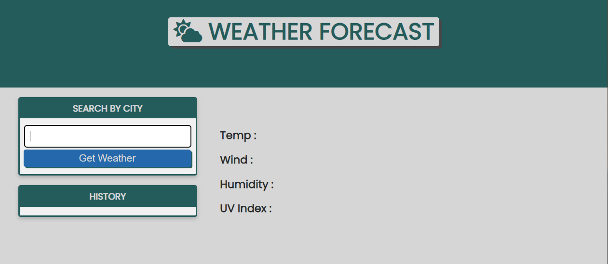
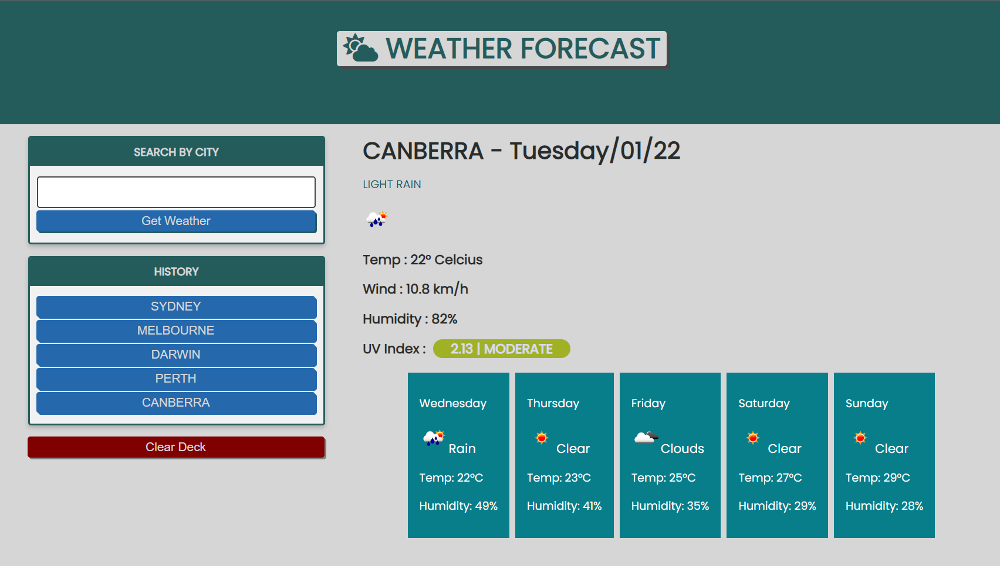

# WEATHER FORECAST

---

## Motivation

The motivation behind this project is a practicality, and help people plan their day or even few days in advance by check to weather on that day and the next five days. This application will come really handy for people that need to plan their day for outside activity. Other than that this application is one of the project i am doing to implement what i have learnt for the past weeks.

---
## Installation

The Installation of this webpage will be straight forward simply click the links below or 
copy the links to the browser you are going to use.

Github link is provided to further check and test.

* Webpage Link
https://tirtasty.github.io/Weather-forecast/

* Github Link
https://github.com/tirtasty/Weather-forecast.git

---

## Usage

** Once you launch the page, it will display the search column, blank temperature, blank wind indicator, blank humidity, and blank UV Index.

** Simply input the city in the coloumn search. The data will appear on the page and it will show the current day and city name, below that will appear brief description of the weather and follow by the image then temperature, wind humidity and UV index will appear on display, also the the end of page 5(five) days forcast will appear on display.

** This the demo how the app will works

---
## Contributors

- Tirta Styadi - <tirta.setiady@yahoo.com>

---

##

© Tirta Styadi, University Of Sydney Coding Bootcamp